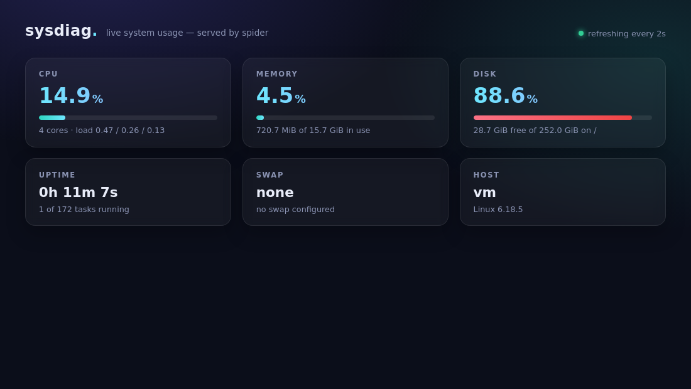

# sysdiag — live system usage dashboard (spider + HTMX)

*2026-06-11T07:26:40Z by Showboat 0.6.1*
<!-- showboat-id: 01cb688c-f3f0-4125-98df-b724e1390db3 -->

Single-binary Zig web server on spider v0.6.7. Metrics come straight from /proc and a statfs(2) syscall; the page polls a server-rendered HTMX fragment every 2s. Built with Zig 0.17.0-dev.813 (spider's floor); the server is already running on :3000 here.

```bash
curl -s localhost:3000/up; echo
```

```output
OK
```

```bash
curl -s localhost:3000/api/metrics | python3 -m json.tool
```

```output
{
    "hostname": "vm",
    "kernel": "6.18.5",
    "uptime_secs": 692,
    "load1": 0.58,
    "load5": 0.3,
    "load15": 0.15,
    "procs_running": 2,
    "procs_total": 182,
    "cpu_pct": 24.253075571177504,
    "cores": 4,
    "mem_total_kb": 16461176,
    "mem_avail_kb": 15732796,
    "swap_total_kb": 0,
    "swap_free_kb": 0,
    "disk_total_b": 270553174016,
    "disk_avail_b": 30791856128
}
```

```bash
curl -s localhost:3000/metrics | head -6; echo
```

```output
<div class="card">
  <div class="label">CPU</div>
  <div class="value">35.3<span class="unit">%</span></div>
  <div class="track"><div class="bar" style="width:35.3%"></div></div>
  <div class="detail">4 cores &middot; load 0.58 / 0.30 / 0.15</div>
</div>

```

And the page itself, captured with rodney (headless Chrome) after two poll cycles:

```bash {image}

```


