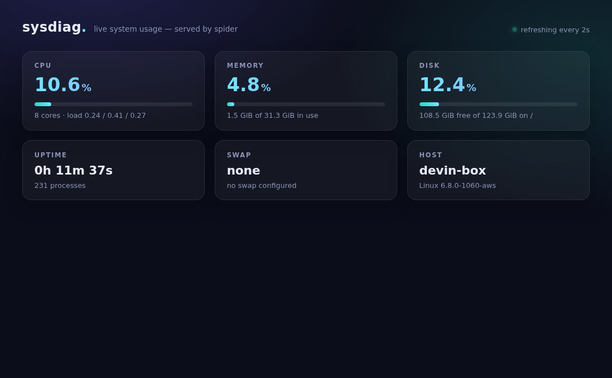

# sysdiag — live system usage dashboard (spider + HTMX)

*2026-11-08T04:52:48Z by Showboat 0.6.1*
<!-- showboat-id: 18c49d5c-ec1e-4335-9503-21083cfa4ae1 -->

Single-binary Zig web server on spider v0.6.7, built with the pinned Zig 0.17.0-dev.813. Metrics come from /proc and a statfs(2) syscall; the page polls a server-rendered HTMX fragment every 2s. The server is already running on :3000.

```bash
curl -s localhost:3000/up; echo
```

```output
OK
```

```bash
curl -s localhost:3000/api/metrics | python3 -m json.tool
```

```output
{
    "hostname": "devin-box",
    "kernel": "6.8.0-1060-aws",
    "uptime_secs": 700,
    "load1": 0.3,
    "load5": 0.42,
    "load15": 0.27,
    "procs_total": 230,
    "cpu_pct": 11.136450019004181,
    "cores": 8,
    "mem_total_kb": 32866612,
    "mem_avail_kb": 31325972,
    "swap_total_kb": 0,
    "swap_free_kb": 0,
    "disk_total_b": 133003395072,
    "disk_avail_b": 116461654016
}
```

```bash
curl -s localhost:3000/metrics | head -6; echo
```

```output
<div class="card">
  <div class="label">CPU</div>
  <div class="value">15.7<span class="unit">%</span></div>
  <div class="track"><div class="bar" style="width:15.7%"></div></div>
  <div class="detail">8 cores &middot; load 0.30 / 0.42 / 0.27</div>
</div>

```

The page itself, captured with rodney (headless Chrome) after one poll:

```bash {image}

```


